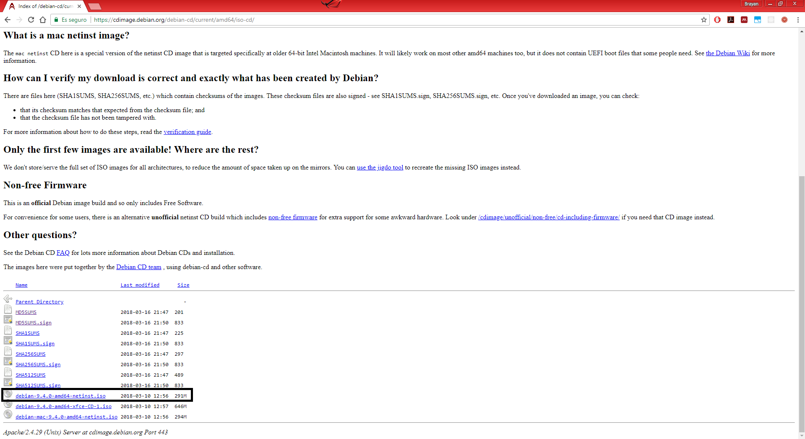
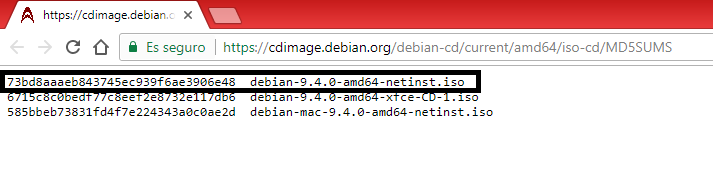
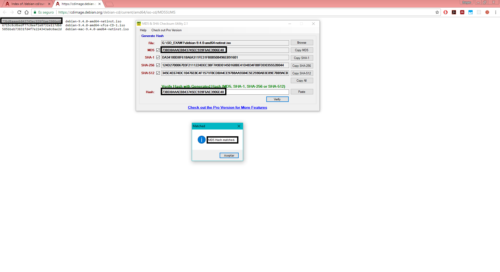
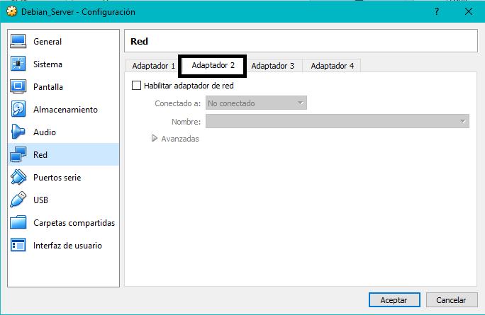
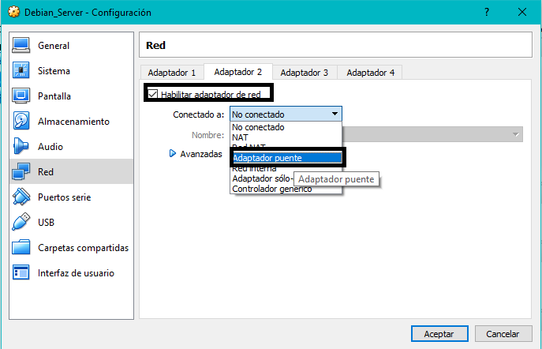
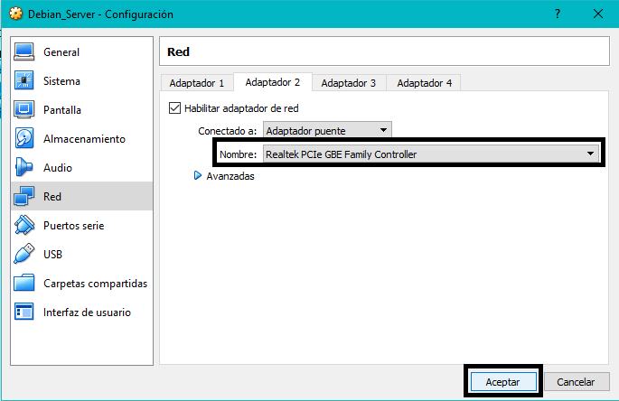
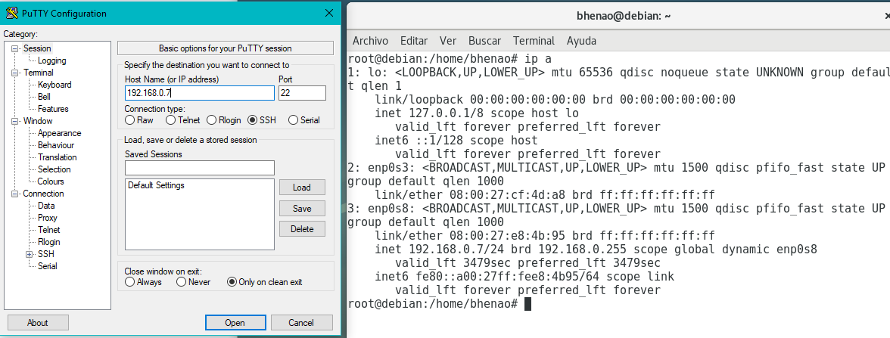
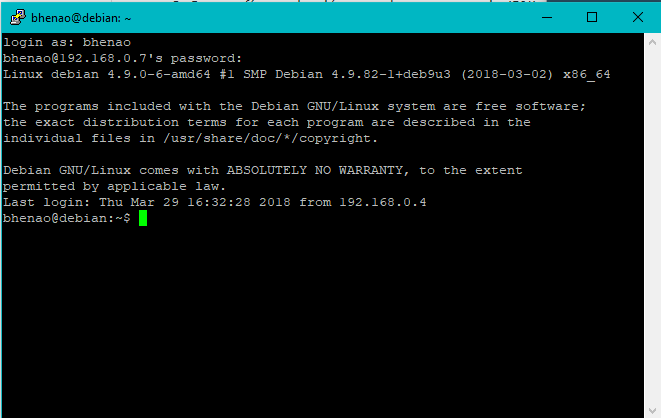

# Sistemas Operacionales - Parcial 1
**Nombre:** Brayan Andrés Henao  
**Código:** A00056004  
**Correo:** bryanhenao96@gmail.com  
**URL Repositorio:** https://github.com/brayanhenao/so-exam1/tree/bhenao-soexam1 
___

### Descarga e instalación Debian 9

#### Descarga

La imagen se descarga de [Debian 9](https://cdimage.debian.org/debian-cd/current/amd64/iso-cd/debian-9.4.0-amd64-netinst.iso) como se muestra en la captura.


Una vez tenemos la imagen, procedemos a verificar su MD5 para ver si la imagen no fue alterada por terceros. Para esto, utilizamos el programa [MD5 Checksum Utility](https://download.cnet.com/MD5-SHA-Checksum-Utility/3001-2092_4-10911445.html). Los checksum de cada imagen se encuentran an la página oficial de Debian [Checksums](https://cdimage.debian.org/debian-cd/current/amd64/iso-cd/MD5SUMS) 



Abrimos el programa, seleccionamos la imagen y esperamos a que lea y genere los checksums de esta. Una vez generados validamos si los checksums son iguales con la herramienta.


#### Instalación

Para instalarlo utilizamos [VirtualBox](https://www.virtualbox.org/wiki/Downloads), configuramos los recursos que le vamos a asignar (Memoria RAM, # Procesadores, tamaño del HDD), montamos la imagen en el disco de arranque. Una vez iniciado seguimos el proceso guiado.

1. Una vez iniciada la máquina virtual, seleccionamos "Graphical Install", ya que es un modo más amigable con el usuario (el otro modo es nétamente por consola).
2. Paso siguiente seleccionamos el idioma a utilizar (Español) al igual que el país (Colombia) y la distribución del teclado (Latinoamericano).
3. Procedemos a la configuración de la red (nombre de la máquina y el dominio) y la configuración de usuario (contraseña de root y si queremos crear un nuevo usuario con su contraseña).
4. Siguiendo con la instalación configuramos la partición de discos: utilizamos el modo guiado, seleccionamos el disco a usar (préviamente creado al agregar la máquina virtual), seleccionamos la opción "Todos los ficheros en una partición" y finalizamos el particionado del disco confirmando los cambios.
5. Esperamos a que instale el sistema base y procedemos a configurar el gestor de paquetes, seleccionando la región y el servidor ftp a utilizar, en nuestro caso "debian.uniminuto.edu".
6. Siguiendo, seleccionamos los programas adicionales que queremos instalar (como el entorno de escritorio, servidor web, servidor de impresión, SSH server) el único relevante y que debemos seleccionar es "SSH Server" ya que será usado posteriormente si se quiere conectar por medio de SSH desde otras máquinas.
7. Como último paso, una vez descargados los paquetes previamente seleccionados nos pedirá instalar GRUB, que es el gestor de boot de linux (en el caso de que quiera se utilziado en la misma máquina junto con otro SO distinto). Aceptamos su instalación y seleccionamos el HDD en el cual quedará el lanzador.

Una vez finalziado estos pasos, el sistema informará que la instalación fue exitosa y paso siguiente se reiniciará.

### Información del SO
Para obtener la información del sistema operativo instalado previamente usamos los siguientes comandos (junto con su resultado en consola)

```console
root@debian:/home/bhenao# cat /proc/version
Linux version 4.9.0-6-amd64 (debian-kernel@lists.debian.org) (gcc version 6.3.0 20170516 (Debian 6.3.0-18+deb9u1) ) #1 SMP Debian 4.9.82-1+deb9u3 (2018-03-02)
```

```console
root@debian:/home/bhenao# lsb_release -a
No LSB modules are available.
Distributor ID: Debian
Description:    Debian GNU/Linux 9.4 (stretch)
Release:        9.4
Codename:       stretch
```

### Configuración interfaz de red y conexión con Putty

#### Configuración interfaz tipo puente
Para configurar una interfaz de red tipo puente procedos a abrir en VirtualBox la configuración de la máquina virtual previamente creada, nos dirigimos a la sección "Red" y seleccionamos la pestaña "Adaptador 2"



Habilitamos el adaptador y seleccionamos en "Conectado a" el adaptador a utilizar, en este caso "Adaptador puente" (esto para poder realizar una conexión con la máquina host por medio de SSH)



Seleccionamos la tarjeta de red que tenemos y aceptamos los cambios para poder utilizar el adaptador.



#### Conexión utilizando Putty (Windows)
Para conectarnos desde la máquina host a la máquina guest utilizamos [Putty](https://www.chiark.greenend.org.uk/~sgtatham/putty/latest.html) (ya que el SO host es Windows).

En la máquina Debian utilizamos el siguiente comando el cual nos informará las interfaces de red que tenemos actualmente en la máquina, así como la dirección ip (la que nos interesa es enp0s8 que es el adaptador puente) que debemos colocar en putty.
```console
ip -a
```


Una vez escrita la ip y el puerto (22 porque es SSH) le damos en ok. Si no hay errores, aparecerá una ventana solicitando un usuario y contraseña para poder ingresar a la máquina.


